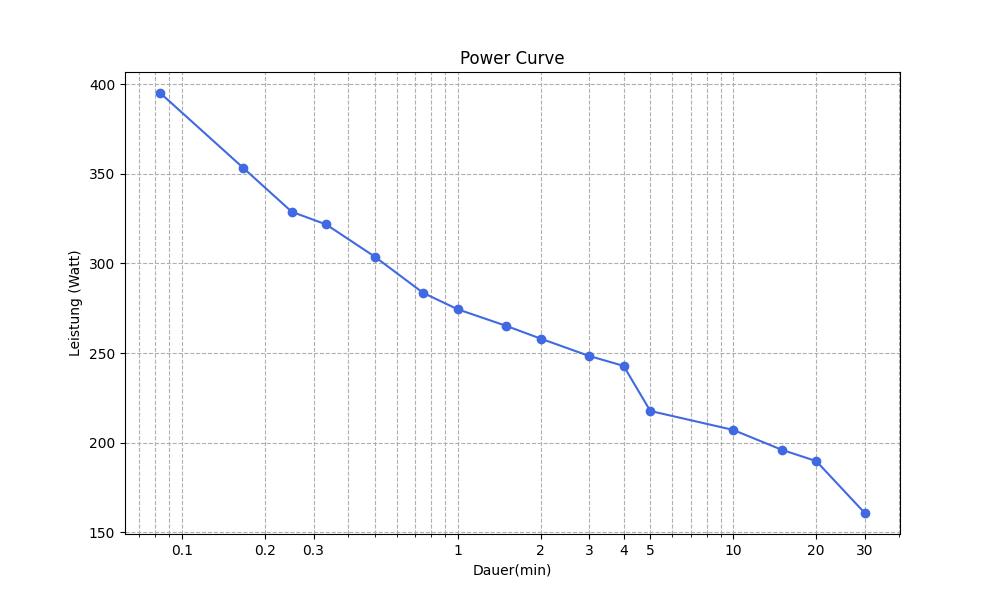

# programmieruebung_2-5
Aufgabe 4 für Progrommieren 2
Leistungskurve II 

Dieses Programm ermöglicht es, eine .csv Datei mit EKG Daten einzulesen und daraus eine Power - Curve zu erstellen. Es werden unsere Messwerte in mV (auf der y-Achse) und unsere Zeit in ms (auf der x-Achse) dargestellt. 

Voraussetzungen:
Zum Ausführen des Projekts werden Python und das Paketverwaltungstool PDM benötigt. Falls PDM noch nicht installiert ist, kann dies über pdm init gemacht werden. 
Für den Code werden drei verschiedene Module benötigt: pandas, matplotlib und plotly. 

Projekt ausführen:
1. Projektordner klonen oder herunterladen 
2. Im Projektverzeichnis folgende Befehle ausführen:
pdm init 
pdm add pandas, matplotlib, plotly

Die App starten indem man oben rechts auf "Run Python File" klickt.

Datenstruktur:
Die Datei activity.csv im Ordner data/activities enthält die Herzfrequenz- und Leistungsdaten.

Screenshot der App:

